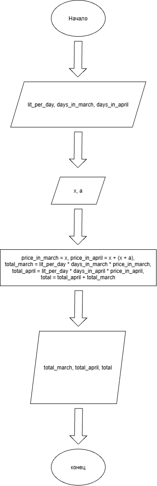

# Домашнее задание к работе 2

## Уловие задачи
В течение месяца продавец доставлял на дом 4 л. молока в день. В марте молоко стоило **x** руб. за литр. С первого апреля цена молока увеличилась на **(x + a)** руб. за литр. Сколько надо заплатить продавцу за все доставленное молоко в конце апреля? Количество покупаемого молока осталось прежним.

## 1. Алгоритм

1. **Начало**
2. Объявить константы:
   - `DAILY_VOLUME` = 4 (л/день) — ежедневный объем покупки.
   - `DAYS_IN_MARCH` = 31 — количество дней в марте.
   - `DAYS_IN_APRIL` = 30 — количество дней в апреле.
3. Задать исходные данные:
   - `x` — цена 1 литра молока в марте (руб.).
   - `a` — величина, на которую базовая цена увеличивается в апреле (руб.).
4. Вычислить стоимость молока в марте:
   - `price_march` = `x`
   - `total_march` = `DAILY_VOLUME` * `DAYS_IN_MARCH` * `price_march`
5. Вычислить новую цену молока в апреле:
   - `price_april` = `x` + (`x` + `a`)
6. Вычислить стоимость молока в апреле:
   - `total_april` = `DAILY_VOLUME` * `DAYS_IN_APRIL` * `price_april`
7. Вычислить общую сумму к оплате:
   - `total_to_pay` = `total_march` + `total_april`
8. Вывести результаты расчетов с подстановкой всех значений в текст.
9. **Конец**

### Блок-схема

[https://app.diagrams.net/#Llab_2_schema.png#%7B"pageId"%3A"pb7W6HS26pRakyBxzzPw"%7D](# "как lab_2_schema.png")

## 2. Реализация программы

<!-- #include <locale.h>
#include <stdio.h>

int main()
{
	setlocale(LC_CTYPE, "");
	// Инициализация констант
	const int lit_per_day = 4;
	const int days_in_march = 31;
	const int days_in_april = 30;
	// Инициализация переменных
	float x = 25;
	float a = 10;
	// Цены за литр в марте и апреле
	float price_in_march = x; 
	float price_in_april = x + (x + a); // Новая цена в апреле
	// Рассчет стоимости в марте, апреле и общей стоимости
	float total_march = lit_per_day * days_in_march * price_in_march;
	float total_april = lit_per_day * days_in_april * price_in_april;
	float total = total_april + total_march;
	// Форматированный вывод результатов
	printf("Расчет:\n");
	printf("Стоимость за литр в апреле равна %.2f + (%.2f + %.2f) = %.2f рублей\n", price_in_march, x, a, price_in_april);
	printf("Общая стоимость в марте равна %d * %d * %.2f = %.2f рублей\n", lit_per_day, days_in_march, price_in_march, total_march);
	printf("Общая стоимость в апреле равна %d * %d * %.2f = %.2f рублей\n", lit_per_day, days_in_april, price_in_april, total_april);
	printf("Общая стоимость за 2 месяца %.2f * %.2f = %.2f рублей", total_april, total_march, total);
}-->

## 3. Результаты работы программы

[Расчет:
Стоимость за литр в апреле равна 25.00 + (25.00 + 10.00) = 60.00 рублей
Общая стоимость в марте равна 4 * 31 * 25.00 = 3100.00 рублей
Общая стоимость в апреле равна 4 * 30 * 60.00 = 7200.00 рублей
Общая стоимость за 2 месяца 7200.00 * 3100.00 = 10300.00 рублей]

## 4. Информация о разработчике

Азиханов Дамир, бТИИ-262
